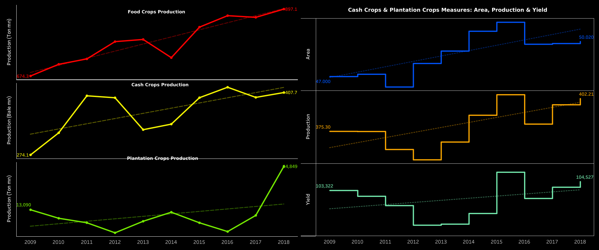

# 🌾 India's Agricultural Crop Production Analysis

A Tableau-based data visualization project that analyzes agricultural crop production in India using historical crop production data (1997–2021). The project provides interactive dashboards to explore crop production trends across different states, years, seasons, and crop types.

---

## 📌 Project Overview

Agriculture plays a vital role in India's economy. This project aims to analyze historical agricultural crop production data and present meaningful insights through interactive Tableau dashboards.

The dashboard helps users understand:

- Crop production trends over the years
- State-wise agricultural production
- Seasonal crop distribution
- Major crops contributing to production
- Comparative analysis across states and years

---

## 📂 Repository Structure

```
India-s-Agricultural-Crop-Production-Analysis/
│
├── project/
│   ├── Dashboard/
│   │   └── dashboard.png
│   │
│   ├── Dataset/
│   │   └── India's Agricultural Crop Production Analysis.csv
│   │
│   ├── Tableau/
│   │   └── India Agriculture crop production.twbx
│   │
│   └── README.md
│
└── README.md
```

---

## 📊 Dashboard Features

The Tableau dashboard provides interactive visualizations including:

- 📈 Year-wise Crop Production
- 🌾 Crop-wise Production Analysis
- 🗺️ State-wise Production Distribution
- 🌦️ Season-wise Crop Analysis
- 🔍 Interactive Filters
- 📌 KPI Cards for Production Statistics

---

## 🛠️ Tools & Technologies

- Tableau Desktop
- Microsoft Excel
- CSV Dataset
- Git & GitHub

---

## 📁 Dataset

The dataset contains agricultural crop production records for India from **1997 to 2021**.

It includes attributes such as:

- State
- District
- Crop Year
- Season
- Crop
- Area
- Production

---

📷 Dashboard Preview

<p align="center">
  
</p>

---

## 🚀 How to Use

1. Clone the repository

```bash
git clone git@github.com:seelamsudheer4717/India-s-Agricultural-Crop-Production-Analysis.git
```

2. Open the Tableau workbook

```
project/Tableau/India Agriculture crop production.twbx
```

3. If prompted, connect the workbook to the dataset located in

```
project/Dataset/
```

---

## 📈 Key Insights

- Agricultural production has changed significantly over the years.
- Certain states consistently contribute higher crop production.
- Production varies across different crop seasons.
- Rice, Wheat, and Sugarcane are among the major contributors.
- Interactive filters allow detailed exploration by state, crop, and year.

---

## 🎯 Learning Outcomes

This project demonstrates:

- Data Cleaning
- Data Visualization
- Dashboard Design
- Tableau Storytelling
- Agricultural Data Analysis
- Business Intelligence

---

## 📌 Future Improvements

- Add more recent agricultural datasets
- Publish dashboard on Tableau Public
- Include predictive analytics
- Develop a Power BI version
- Build a web dashboard

---

## 👨‍💻 Author

**Sudheer Seelam**

GitHub:
https://github.com/seelamsudheer4717

---

## ⭐ Support

If you found this project helpful, consider giving it a ⭐ on GitHub.
